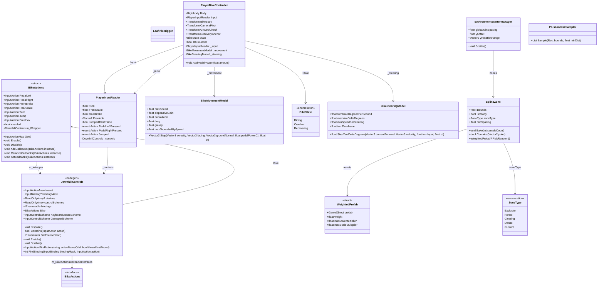

# Code Map

> Auto-generated by `tools/codemap`. Re-run `scripts/generate-codemap.sh` to refresh.

```mermaid
classDiagram

    %% namespace: (global)
    class LeafPileTrigger {
    }

    %% namespace: Downhill.Input
    class BikeActions {
        <<struct>>
        +InputAction PedalLeft
        +InputAction PedalRight
        +InputAction FrontBrake
        +InputAction RearBrake
        +InputAction Turn
        +InputAction Jump
        +InputAction Freelook
        +bool enabled
        +DownhillControls m_Wrapper
        +InputActionMap Get()
        +void Enable()
        +void Disable()
        +void AddCallbacks(IBikeActions instance)
        +void RemoveCallbacks(IBikeActions instance)
        +void SetCallbacks(IBikeActions instance)
    }
    class DownhillControls {
        <<codegen>>
        +InputActionAsset asset
        +InputBinding? bindingMask
        +ReadOnlyArray<InputDevice>? devices
        +ReadOnlyArray<InputControlScheme> controlSchemes
        +IEnumerable<InputBinding> bindings
        +BikeActions Bike
        +InputControlScheme KeyboardMouseScheme
        +InputControlScheme GamepadScheme
        +void Dispose()
        +bool Contains(InputAction action)
        +IEnumerator<InputAction> GetEnumerator()
        +void Enable()
        +void Disable()
        +InputAction FindAction(string actionNameOrId, bool throwIfNotFound)
        +int FindBinding(InputBinding bindingMask, InputAction action)
    }
    class IBikeActions {
        <<interface>>
    }
    class PlayerInputReader {
        +float Turn
        +float FrontBrake
        +float RearBrake
        +Vector2 Freelook
        +bool JumpedThisFrame
        +event Action PedalLeftPressed
        +event Action PedalRightPressed
        +event Action Jumped
        -DownhillControls _controls
    }

    %% namespace: Downhill.Player
    class BikeMovementModel {
        +Vector3 Step(Vector3 velocity, Vector3 facing, Vector3 groundNormal, float pedalPower01, float dt)
        +float maxSpeed
        +float slopeDriveGain
        +float pedalAccel
        +float drag
        +float gravity
        +float maxGroundedUpSpeed
    }
    class BikeState {
        <<enumeration>>
        Riding
        Crashed
        Recovering
    }
    class BikeSteeringModel {
        +float StepYawDeltaDegrees(Vector3 currentForward, Vector3 velocity, float turnInput, float dt)
        +float turnRateDegreesPerSecond
        +float maxYawDeltaDegrees
        +float minSpeedForSteering
        +float turnDeadzone
    }
    class PlayerBikeController {
        +Rigidbody Body
        +PlayerInputReader Input
        +Transform BikeBody
        +Transform CameraPivot
        +Transform GroundCheck
        +Transform RecoveryAnchor
        +BikeState State
        +bool IsGrounded
        +void AddPedalPower(float amount)
        -PlayerInputReader _input
        -BikeMovementModel _movement
        -BikeSteeringModel _steering
    }

    %% namespace: EnvironmentScatter
    class EnvironmentScatterManager {
        +void Scatter()
        +float globalMinSpacing
        +float yOffset
        +Vector2 yRotationRange
    }
    class PoissonDiskSampler {
        +List<Vector2> Sample(Rect bounds, float minDist)
    }
    class SplineZone {
        +Rect Bounds
        +bool IsReady
        +void Bake(int sampleCount)
        +bool Contains(Vector2 point)
        +WeightedPrefab? PickRandom()
        +ZoneType zoneType
        +float minSpacing
    }
    class WeightedPrefab {
        <<struct>>
        +GameObject prefab
        +float weight
        +float minScaleMultiplier
        +float maxScaleMultiplier
    }
    class ZoneType {
        <<enumeration>>
        Exclusion
        Forest
        Clearing
        Dense
        Custom
    }

    %% --- relationships ---
    DownhillControls --> BikeActions : Bike
    DownhillControls --> IBikeActions : m_BikeActionsCallbackInterfaces
    BikeActions --> DownhillControls : m_Wrapper
    PlayerInputReader --> DownhillControls : _controls
    PlayerBikeController --> PlayerInputReader : Input
    PlayerBikeController --> BikeState : State
    PlayerBikeController --> PlayerInputReader : _input
    PlayerBikeController --> BikeMovementModel : _movement
    PlayerBikeController --> BikeSteeringModel : _steering
    EnvironmentScatterManager --> SplineZone : zones
    SplineZone --> ZoneType : zoneType
    SplineZone --> WeightedPrefab : assets
```
